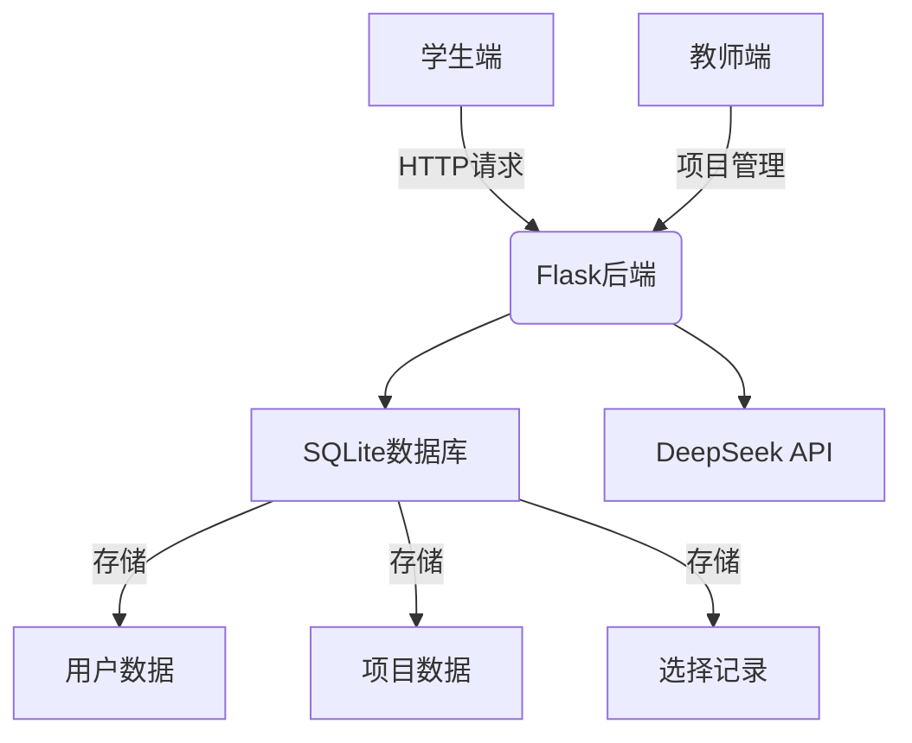

# 🎓 AI Project Match

<div align="center">


</div>

AI Project Match 是一个基于 AI 的智能项目匹配平台，帮助学生找到最适合的毕业设计项目，并连接学生与指导教师。

## ✨ 特性

- 🤖 **AI 智能匹配**: 利用 DeepSeek API 进行智能项目推荐
- 👥 **双角色系统**: 支持教师发布项目和学生选择项目
- 💬 **智能对话**: 自然语言交互，精准理解学生需求
- 🎯 **精准推荐**: 基于多维度分析的项目匹配算法
- 🔄 **实时反馈**: 即时的项目选择和取消功能

## 🚀 快速开始

### 环境要求

- Python 3.8+
- Flask 2.0+
- SQLite3
- 现代浏览器（推荐 Chrome）

### 安装步骤

1. 克隆仓库
```bash
git clone https://github.com/Revolt3738/32933-AI-Project-Match.git
cd 32933-AI-Project-Match
```

2. 安装依赖
```bash
pip install -r requirements.txt
```

3. 配置环境变量
```bash
cp .env.example .env
# 编辑 .env 文件，填入必要的配置信息
```

4. 初始化数据库
```bash
python app.py
```

5. 运行应用
```bash
flask run
```

访问 http://localhost:5000 开始使用！

## 🔧 系统架构



## 🎯 核心功能

### 教师端
- 创建和管理项目
- 查看对项目感兴趣的学生
- 项目信息的编辑和更新

### 学生端
- AI 驱动的项目推荐
- 自然语言交互
- 项目选择和取消
- 实时查看已选项目状态

## 📝 API 文档

### 主要接口
- `POST /api/chat` - AI 对话接口
- `GET /api/projects` - 获取项目列表
- `POST /api/projects` - 创建新项目
- `POST /api/interest/:project_id` - 表达项目兴趣

详细的 API 文档请参见 [API.md](docs/API.md)

## 📄 开源协议

本项目采用 MIT 协议开源，详见 [LICENSE](LICENSE) 文件。

## 🔑 演示账号

- 教师账号：demo_teacher@test.com / test123
- 学生账号：demo_student@test.com / test123
