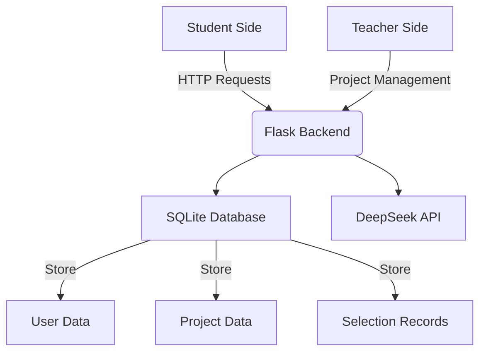

# 🎓 AI Project Match

<div align="center">


</div>

AI Project Match is an intelligent platform based on AI that helps students find the most suitable graduation design projects and connects students with supervising teachers.

## ✨ Features

- 🤖 **AI Intelligent Matching**: Using DeepSeek API for smart project recommendations
- 👥 **Dual-Role System**: Supporting teachers to publish projects and students to select projects
- 💬 **Intelligent Dialogue**: Natural language interaction, precisely understanding student needs
- 🎯 **Precise Recommendations**: Project matching algorithm based on multi-dimensional analysis
- 🔄 **Real-time Feedback**: Instant project selection and cancellation functionality

## 🚀 Quick Start

### Requirements

- Git
- Python 3.9+ (3.13+ recommended)
- pip (Python package manager)
- SQLite3 (usually installed with Python)
- Modern browser (Chrome recommended)

### Installation Steps

1.  **Clone Repository**

    ```bash
    git clone https://github.com/Revolt3738/32933-AI-Project-Match.git
    cd 32933-AI-Project-Match
    ```

2.  **Create and Activate Virtual Environment** (recommended)

    *   **Windows (PowerShell):**
        ```powershell
        python -m venv venv
        .\venv\Scripts\Activate.ps1
        # If you encounter script execution policy issues, you may need to run: Set-ExecutionPolicy -ExecutionPolicy RemoteSigned -Scope Process
        ```
    *   **Linux / macOS (bash):**
        ```bash
        python3 -m venv venv
        source venv/bin/activate
        ```
    *   *After activation, `(venv)` should appear before the terminal prompt.*

3.  **Install Dependencies**

    *   In the activated virtual environment, run:
        ```bash
        pip install -r requirements.txt
        ```

4.  **Configure Environment Variables**

    *   Copy the example file:
        ```bash
        # Windows (cmd/powershell)
        copy .env.example .env
        # Linux / macOS
        cp .env.example .env
        ```
    *   **Edit the `.env` file**, at least fill in your `DEEPSEEK_API_KEY`:
        ```dotenv
        SECRET_KEY='a random and secure string'  # Optional, a default value will be used if not provided
        DATABASE_URL='sqlite:///instance/test.db' # Optional, SQLite is used by default
        DEEPSEEK_API_KEY='your DeepSeek API key' # Required
        ```

5.  **Initialize Database and Run Application**

    *   The application will automatically initialize the database on first run. Simply start the development server:
        ```bash
        python app.py
        ```
    *   The application will:
        - Create the SQLite database in `instance/test.db`
        - Set up all required tables
        - Insert test data (teacher and student accounts, sample projects)
        - Start the Flask development server on http://127.0.0.1:5000

6.  **Access the Application**

    Open http://localhost:5000 (or another address output by Flask) in your browser to start using it!

## 💻 Technology Stack

### Backend
- **Flask 3.1.1** - Modern Python web framework
- **SQLAlchemy 2.0.41** - Advanced ORM with enhanced type safety
- **Flask-SQLAlchemy 3.1.1** - Flask integration for SQLAlchemy
- **Flask-Login 0.6.3** - User session management
- **Werkzeug 3.1.3** - WSGI utilities and security

### AI Integration
- **OpenAI 1.93.0** - Latest OpenAI Python SDK
- **DeepSeek API** - AI-powered project matching

### Frontend
- **Jinja2** - Template engine
- **Bootstrap** - Responsive CSS framework
- **Vanilla JavaScript** - Client-side interactivity

### Database
- **SQLite 3** - Lightweight database for development
- **Python-dotenv 1.0.1** - Environment variable management

## 🔧 System Architecture



## 🎯 Core Functions

### Teacher Side
- Create and manage projects
- View students interested in projects
- Edit and update project information

### Student Side
- AI-driven project recommendations
- Natural language interaction
- Project selection and cancellation
- Real-time viewing of selected project status

## 📝 API Documentation

### Main Interfaces
- `POST /api/chat` - AI conversation interface
- `GET /api/projects` - Get project list
- `POST /api/projects` - Create new project
- `POST /student_interest/:project_id` - Express interest in a project
- `POST /cancel_interest/:project_id` - Cancel project interest

For detailed API documentation, please see [API.md](docs/API.md)

## 📄 License

This project is open-sourced under the MIT License, see the [LICENSE](LICENSE) file for details.

## 🔑 Test Accounts

- Teacher account: teacher@test.com / teacher123
- Student account: student@test.com / student123
