# 🎓 AI Project Match

<div align="center">


</div>

AI Project Match 是一个基于 AI 的智能项目匹配平台，帮助学生找到最适合的毕业设计项目，并连接学生与指导教师。

## ✨ 特性

- 🤖 **AI 智能匹配**: 利用 DeepSeek API 进行智能项目推荐
- 👥 **双角色系统**: 支持教师发布项目和学生选择项目
- 💬 **智能对话**: 自然语言交互，精准理解学生需求
- 🎯 **精准推荐**: 基于多维度分析的项目匹配算法
- 🔄 **实时反馈**: 即时的项目选择和取消功能

## 🚀 快速开始

### 环境要求

- Git
- Python 3.8+
- pip (Python 包管理器)
- SQLite3 (通常随 Python 一起安装)
- 现代浏览器（推荐 Chrome）

### 安装步骤

1.  **克隆仓库**

    ```bash
    git clone https://github.com/Revolt3738/32933-AI-Project-Match.git
    cd 32933-AI-Project-Match
    ```

2.  **创建并激活虚拟环境** (推荐)

    *   **Windows (PowerShell):**
        ```powershell
        python -m venv venv
        .\venv\Scripts\Activate.ps1
        # 如果遇到脚本执行策略问题，可能需要先运行: Set-ExecutionPolicy -ExecutionPolicy RemoteSigned -Scope Process
        ```
    *   **Linux / macOS (bash):**
        ```bash
        python3 -m venv venv
        source venv/bin/activate
        ```
    *   *激活后，终端提示符前应出现 `(venv)`。*

3.  **安装依赖**

    *   在激活的虚拟环境中运行：
        ```bash
        pip install -r requirements.txt
        ```

4.  **配置环境变量**

    *   复制示例文件：
        ```bash
        # Windows (cmd/powershell)
        copy .env.example .env
        # Linux / macOS
        cp .env.example .env
        ```
    *   **编辑 `.env` 文件**，至少填入你的 `DEEPSEEK_API_KEY`：
        ```dotenv
        SECRET_KEY='一个随机且安全的字符串'  # 可选，不填会使用默认值
        DATABASE_URL='sqlite:///instance/test.db' # 可选，默认使用 SQLite
        DEEPSEEK_API_KEY='你的DeepSeek API密钥' # 必需
        ```

5.  **初始化数据库并运行应用**

    *   运行 `app.py` 会自动检查并创建数据库（如果不存在），然后启动开发服务器：
        ```bash
        python app.py
        ```
    *   或者，如果只想运行应用而不依赖 `app.py` 中的初始化逻辑（假设数据库已存在或通过其他方式创建）：
        ```bash
        flask run
        ```

6.  **访问应用**

    在浏览器中打开 http://localhost:5000 (或 Flask 输出的其他地址)。


## 🔧 系统架构

```mermaid
flowchart TD
    A[学生端] -->|HTTP请求| B(Flask后端)
    B --> C[SQLite数据库]
    B --> D[DeepSeek API]
    E[教师端] -->|项目管理| B
    C -->|存储| F[用户数据]
    C -->|存储| G[项目数据]
    C -->|存储| H[选择记录]
```



## 🎯 核心功能

### 教师端
- 创建和管理项目
- 查看对项目感兴趣的学生
- 项目信息的编辑和更新

### 学生端
- AI 驱动的项目推荐
- 自然语言交互
- 项目选择和取消
- 实时查看已选项目状态

## 📝 API 文档

### 主要接口
- `POST /api/chat` - AI 对话接口
- `GET /api/projects` - 获取项目列表
- `POST /api/projects` - 创建新项目
- `POST /api/interest/:project_id` - 表达项目兴趣

详细的 API 文档请参见 [API.md](docs/API.md)

## 📄 开源协议

本项目采用 MIT 协议开源，详见 [LICENSE](LICENSE) 文件。

## 🔑 演示账号

- 教师账号：demo_teacher@test.com / test123
- 学生账号：demo_student@test.com / test123
