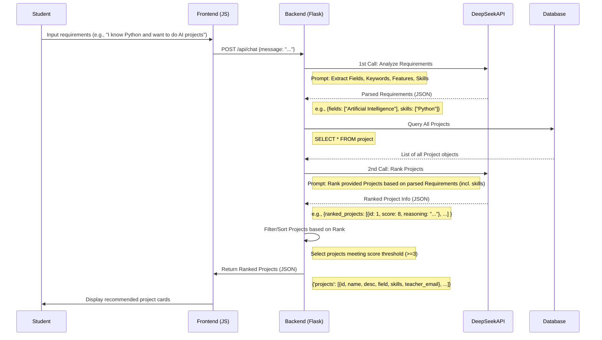
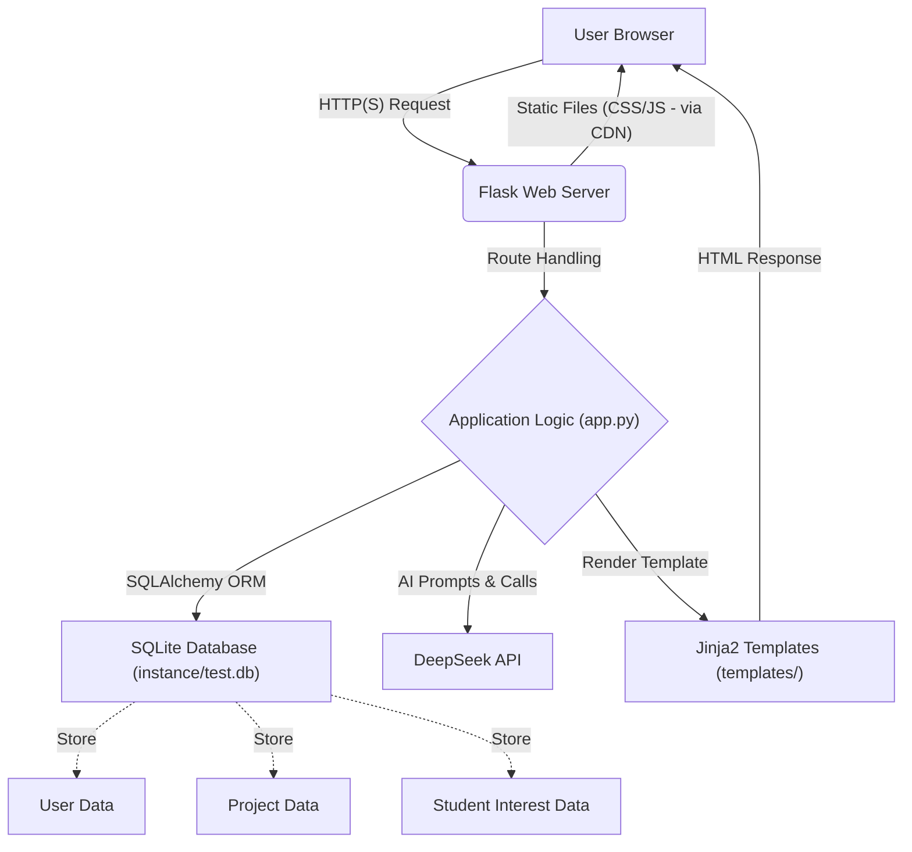
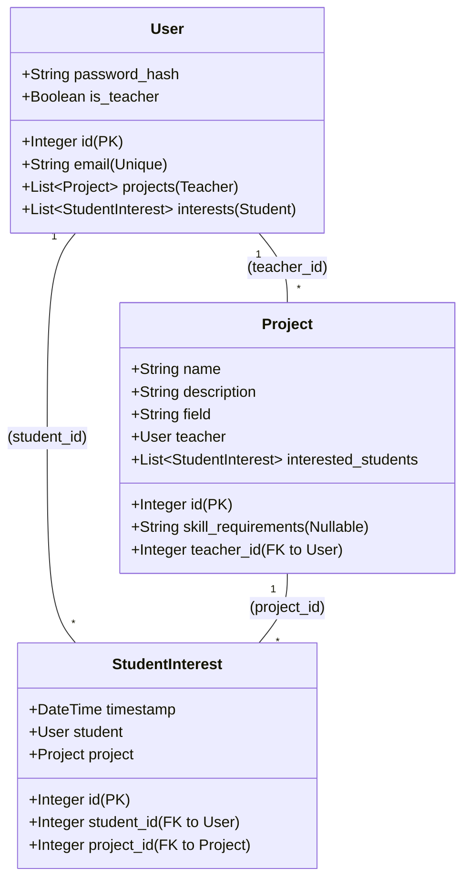

# AI Project Match Platform Development Manual

This manual aims to document the core design, implementation details, and key processes of the AI Project Match platform for better understanding, maintenance, and extension.

## 1. Core Interaction Flow

### 1.1 Student-side Intelligent Matching Process (Sequence Diagram)



## 2. System Architecture Design (Flowchart)



## 3. Key Code Implementation

### 3.1 Two-stage AI Processing (`app.py`)

Core logic implemented in `/api/chat` route and its called functions:

```python
# app.py

@app.route('/api/chat', methods=['POST', 'GET'])
def chat():
    # 1. Get student input
    user_input = request.json.get('message')

    # 2. Stage 1: Analyze requirements (call analyze_user_requirements)
    #    - Use first AI Prompt to extract fields, keywords, features, skills
    requirements = analyze_user_requirements(user_input)

    # 3. Get all projects from database
    projects = Project.query.all()

    # 4. Stage 2: Project ranking (call rank_projects)
    #    - Use second AI Prompt, input is requirements and projects list
    #    - AI returns ranked project info (ID, score, reasoning)
    #    - rank_projects filters and sorts original projects list based on AI results
    ranked_projects = rank_projects(requirements, projects)

    # 5. Return results to frontend
    return jsonify({
        'projects': [{
            'id': p.id,
            'name': p.name,
            # ... other fields ...
            'skill_requirements': p.skill_requirements or '',
            'teacher_email': User.query.get(p.teacher_id).email
        } for p in ranked_projects]
    })

# analyze_user_requirements(user_input)
# - Build prompt with detailed instructions and user input
# - Call call_deepseek_api()
# - Parse AI returned JSON (fields, keywords, features, skills)
# - Handle generic queries (only when AI fails to extract specific information)

# rank_projects(requirements, projects)
# - Build prompt with scoring rules and student requirements/project list
# - Call call_deepseek_api()
# - Parse AI returned JSON (list containing id, score, reasoning)
# - Filter projects by score (>= 3)
# - Reorder project list based on AI ranking
```

### 3.2 AI Prompt Design

*   **Requirements Analysis Prompt (`analyze_user_requirements`)**: Guides AI to extract `fields` (domains), `keywords`, `features`, `skills` from user input and return in specific JSON format.
*   **Project Ranking Prompt (`rank_projects`)**: Guides AI to score based on student requirements (including `fields`, `keywords`, `features`, `skills`) and provided project list (including `name`, `description`, `field`, `skill_requirements`) with 0-10 scoring (covering four dimensions: domain, keywords, features, skills), returning JSON list with `id`, `score`, `reasoning`.

### 3.3 Database Operations (SQLAlchemy)

Uses Flask-SQLAlchemy ORM for database interactions, model definitions see below.

*   Get all projects: `Project.query.all()`
*   Get student interests: `StudentInterest.query.filter_by(student_id=...).all()`
*   Create project: `db.session.add(project_object)`, `db.session.commit()`
*   Get user info: `User.query.get(user_id)`

## 4. Frontend Implementation

### 4.1 Chat Interface (`student_dashboard.html`)

*   Uses standard HTML elements to build chat bubbles and project cards.
*   Uses **Tailwind CSS** (via CDN) for styling and layout.
*   Uses **Vanilla JavaScript** to implement:
    *   Get user input.
    *   Call backend `/api/chat` via `fetch` API.
    *   Dynamically add user messages and AI responses (including project cards) to chat container (`#chat-container`).
    *   Display loading animation (`showLoading`, `hideLoading`).
    *   Handle project selection (`expressInterest`) and cancellation (`cancelInterest`) button clicks, calling corresponding backend APIs (`/student_interest/...`, `/cancel_interest/...`).

```html
<!-- templates/student_dashboard.html (simplified structure) -->
<div id="chat-container">
    <!-- Messages will be dynamically added here -->
</div>
<textarea id="requirements" placeholder="..."></textarea>
<button onclick="sendMessage()">Send</button>

<script>
    function sendMessage() { /* ... fetches /api/chat ... */ }
    function addMessage(msg, isUser) { /* ... adds bubble to chat-container ... */ }
    function displayProjects(projects) { /* ... adds project cards to chat-container ... */ }
    function expressInterest(id) { /* ... fetches /student_interest/... */ }
    // ... etc ...
</script>
```

## 5. AI Integration Specifications

### 5.1 Two-stage Calls

1.  **Requirements Analysis (`analyze_user_requirements`)**: Input is student raw text, output is structured requirements JSON. Uses lower `temperature` (e.g., 0.3) to ensure stable and precise results.
2.  **Project Ranking (`rank_projects`)**: Input is structured requirements JSON and all project data JSON, output is ranked project info JSON. Can use slightly higher `temperature` (e.g., 0.3-0.5) for some flexibility, but still needs to guarantee JSON format.

### 5.2 API Call Wrapper (`call_deepseek_api`)

```python
# app.py
def call_deepseek_api(messages):
    try:
        response = openai.ChatCompletion.create(
            model="deepseek-chat",
            messages=messages,       # List containing system and user roles
            temperature=0.3,         # Can adjust based on stage
            max_tokens=1000,
            # ... other parameters ...
            response_format={"type": "json_object"} # Force JSON output
        )
        return response.choices[0].message.content
    except Exception as e:
        # ... error handling ...
        return None
```
*Note: Currently both stages have `temperature` hardcoded to 0.3 in the code.*

## 6. Data Model Design (SQLAlchemy)



## 7. Deployment and Environment

### 7.1 Environment Requirements

*   Git
*   Python 3.8+
*   pip
*   (SQLite usually comes with Python)

### 7.2 Installation and Running

(See "Quick Start" section in `README.md` for details)

1.  Clone repository
2.  Create and activate virtual environment
3.  Install dependencies (`pip install -r requirements.txt`)
4.  Configure environment variables (`.env` file, especially `DEEPSEEK_API_KEY`)
5.  Run application (`python app.py`) - *Note: This command will reinitialize the database!*

## 8. Test Accounts

The following accounts are created by the `init_db()` function each time `python app.py` is run:

*   **Teacher:** teacher@test.com / teacher123
*   **Student:** student@test.com / student123