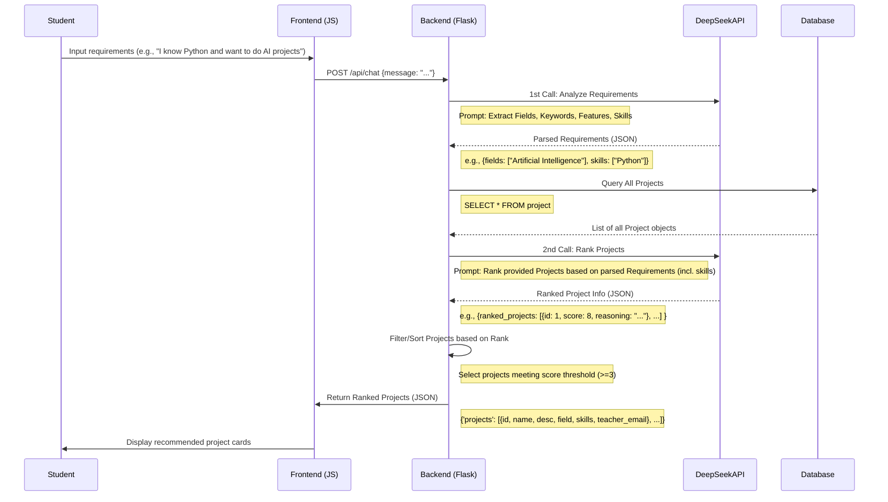

```mermaid
sequenceDiagram
    participant Student
    participant Frontend (JS)
    participant Backend (Flask)
    participant DeepSeekAPI
    participant Database

    Student->>Frontend (JS): Input requirements (e.g., "I know Python and want to do AI projects")
    Frontend (JS)->>Backend (Flask): POST /api/chat {message: "..."}

    Backend (Flask)->>DeepSeekAPI: 1st Call: Analyze Requirements
    Note right of Backend (Flask): Prompt: Extract Fields, Keywords, Features, Skills
    DeepSeekAPI-->>Backend (Flask): Parsed Requirements (JSON)
    Note right of Backend (Flask): e.g., {fields: ["Artificial Intelligence"], skills: ["Python"]}

    Backend (Flask)->>Database: Query All Projects
    Note right of Backend (Flask): SELECT * FROM project;
    Database-->>Backend (Flask): List of all Project objects

    Backend (Flask)->>DeepSeekAPI: 2nd Call: Rank Projects
    Note right of Backend (Flask): Prompt: Rank provided Projects based on parsed Requirements (incl. skills)
    DeepSeekAPI-->>Backend (Flask): Ranked Project Info (JSON)
    Note right of Backend (Flask): e.g., {ranked_projects: [{id: 1, score: 8, reasoning: "..."}, ...] }

    Backend (Flask)->>Backend (Flask): Filter/Sort Projects based on Rank
    Note right of Backend (Flask): Select projects meeting score threshold (>=3)

    Backend (Flask)->>Frontend (JS): Return Ranked Projects (JSON)
    Note right of Backend (Flask): {'projects': [{id, name, desc, field, skills, teacher_email}, ...]}
    Frontend (JS)->>Student: Display recommended project cards
```