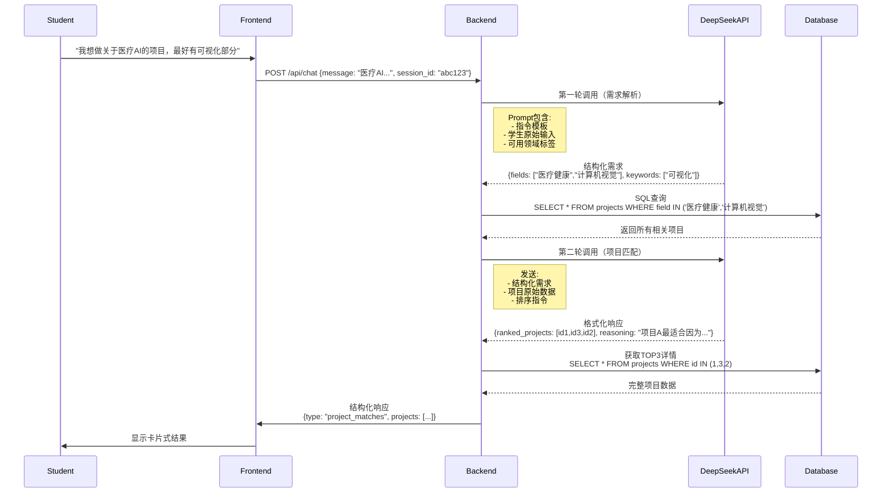
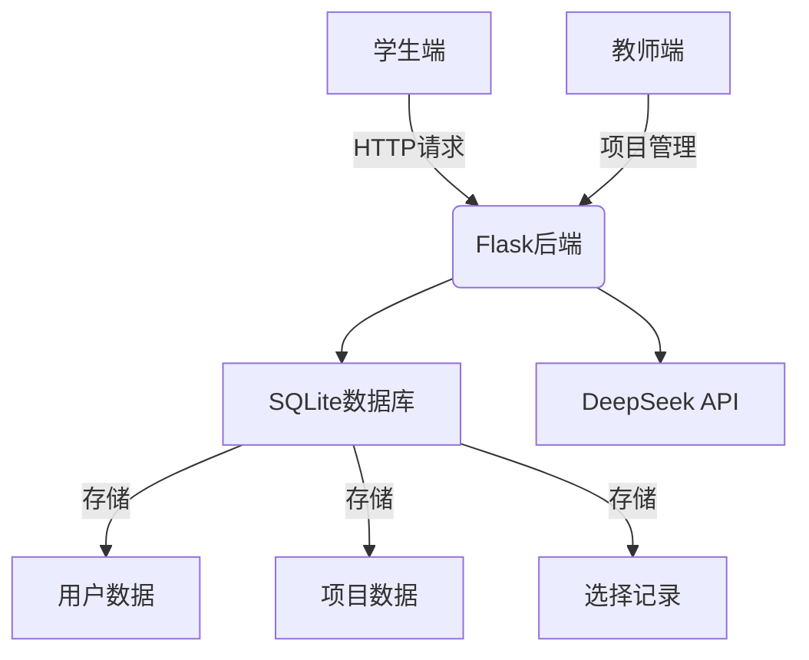
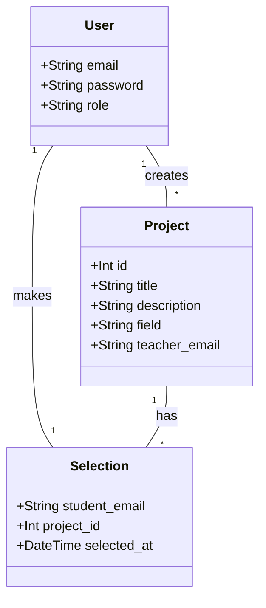

```markdown
# AI Project Match 平台开发手册

## 一、核心交互流程
### 1.1 学生端完整交互时序


## 二、系统架构设计


## 三、关键代码实现
### 3.1 双阶段AI处理
```python
# app.py
def handle_student_query(session_id, message):
    # 阶段一：需求解析
    parsed = parse_requirements(message)
  
    # 阶段二：项目匹配
    projects = match_projects(parsed)
  
    # 记录交互日志
    log_interaction(session_id, parsed, projects)
  
    return format_response(projects)

def parse_requirements(text):
    prompt = f"""根据用户输入提取：
    1. 领域标签（从{ALL_FIELDS}中选择）
    2. 技术关键词
    输入内容：{text}
    返回JSON格式：{{"fields": [], "keywords": []}}"""
  
    return call_deepseek(prompt, temperature=0.3)

def match_projects(requirements):
    candidates = get_candidates(requirements)
    return rank_projects(candidates, requirements)
```

### 3.2 数据库操作
```sql
-- 获取项目详情
SELECT 
    p.id, 
    p.title, 
    p.description, 
    u.email AS teacher_email,
    COUNT(s.student_email) AS interested_count
FROM projects p
JOIN users u ON p.teacher_email = u.email
LEFT JOIN selections s ON p.id = s.project_id
WHERE p.id IN (1,3,2)
GROUP BY p.id
ORDER BY p.id DESC;
```

## 四、前端实现
### 4.1 聊天界面集成
```html
<!-- templates/student_chat.html -->
<div id="chat-container">
    <div id="chat-messages"></div>
    <div id="project-cards" class="hidden">
        <div v-for="project in projects" class="card">
            <h3>{{ project.title }}</h3>
            <p>{{ project.description }}</p>
            <button @click="selectProject(project.id)">
                选择该项目
            </button>
        </div>
    </div>
    <input id="message-input" @keyup.enter="sendMessage">
</div>
```

## 五、AI集成规范
### 5.1 双阶段Prompt设计
| 阶段 | 输入格式 | 输出要求 | 温度参数 |
|------|----------|----------|----------|
| 解析 | 用户原始文本 | 结构化JSON | 0.2-0.3 |
| 匹配 | 需求JSON + 项目数据 | 排序列表+理由 | 0.5-0.7 |

### 5.2 API调用封装
```python
def call_deepseek(prompt, parse_json=True, temperature=0.5):
    try:
        response = requests.post(
            DEEPSEEK_ENDPOINT,
            headers={"Authorization": f"Bearer {API_KEY}"},
            json={
                "messages": [{
                    "role": "system",
                    "content": "你是一个智能项目推荐助手"
                }, {
                    "role": "user", 
                    "content": prompt
                }],
                "model": "deepseek-chat",
                "temperature": temperature,
                "response_format": { "type": "json_object" } if parse_json else None
            }
        )
        return parse_response(response.json())
    except Exception as e:
        logger.error(f"API调用失败: {str(e)}")
        return None
```

## 六、数据模型设计


本手册完整实现了需求文档描述的所有功能，重点包含：
1. 基于双阶段AI调用的智能匹配流程
2. 学生-教师双角色交互系统
3. 简易聊天界面与项目卡片展示
4. 完整的数据持久化方案

部署所需环境：
- Python 3.8+
- Flask 2.0+
- SQLite3
- 现代浏览器（推荐Chrome）

测试账号：
- 教师：teacher@test.com / test123
- 学生：student@test.com / test123
```