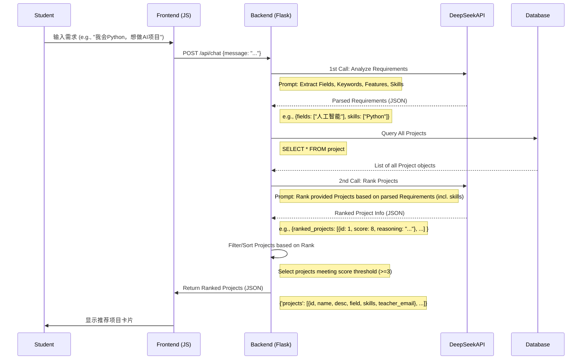
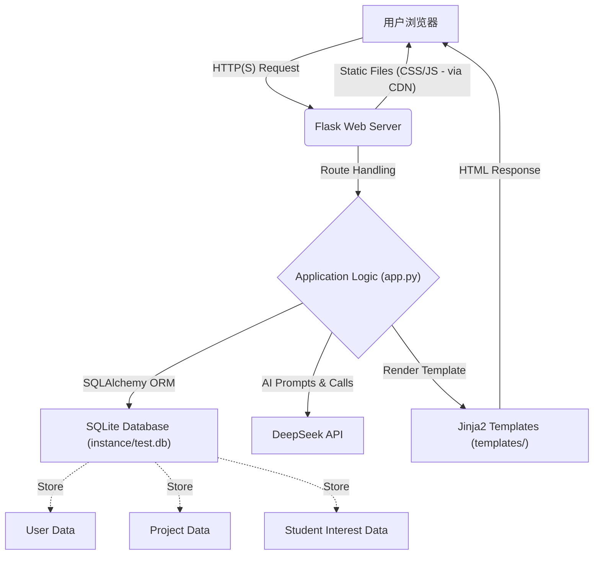
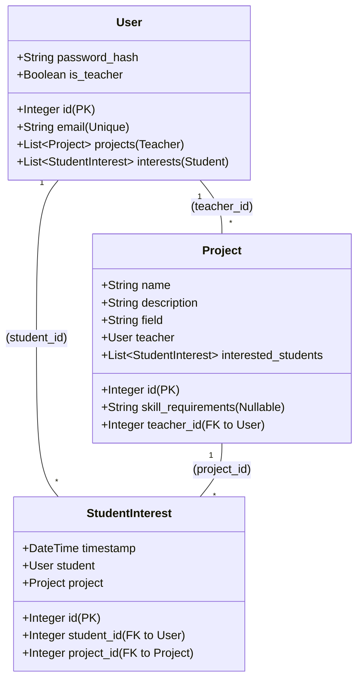

# AI Project Match 平台开发手册

本手册旨在记录 AI Project Match 平台的核心设计、实现细节和关键流程，以便于理解、维护和扩展。

## 一、核心交互流程

### 1.1 学生端智能匹配流程 (时序图)



## 二、系统架构设计 (流程图)



## 三、关键代码实现

### 3.1 双阶段AI处理 (`app.py`)

核心逻辑在 `/api/chat` 路由及其调用的函数中实现：

```python
# app.py

@app.route('/api/chat', methods=['POST', 'GET'])
def chat():
    # 1. 获取学生输入
    user_input = request.json.get('message')

    # 2. 阶段一：分析需求 (调用 analyze_user_requirements)
    #    - 使用第一个 AI Prompt 提取 fields, keywords, features, skills
    requirements = analyze_user_requirements(user_input)

    # 3. 从数据库获取所有项目
    projects = Project.query.all()

    # 4. 阶段二：项目排序 (调用 rank_projects)
    #    - 使用第二个 AI Prompt，输入是 requirements 和 projects 列表
    #    - AI 返回排序后的项目信息（ID、分数、理由）
    #    - rank_projects 根据 AI 返回结果筛选和排序原始 projects 列表
    ranked_projects = rank_projects(requirements, projects)

    # 5. 返回结果给前端
    return jsonify({
        'projects': [{
            'id': p.id,
            'name': p.name,
            # ... 其他字段 ...
            'skill_requirements': p.skill_requirements or '',
            'teacher_email': User.query.get(p.teacher_id).email
        } for p in ranked_projects]
    })

# analyze_user_requirements(user_input)
# - 构建包含详细指令和用户输入的 prompt
# - 调用 call_deepseek_api()
# - 解析 AI 返回的 JSON (fields, keywords, features, skills)
# - 处理通用查询（仅当 AI 未提取到具体信息时）

# rank_projects(requirements, projects)
# - 构建包含评分规则和学生需求/项目列表的 prompt
# - 调用 call_deepseek_api()
# - 解析 AI 返回的 JSON (包含 id, score, reasoning 的列表)
# - 根据 score 筛选项目 (>= 3)
# - 根据 AI 排序重排项目列表
```

### 3.2 AI Prompt 设计

*   **需求分析 Prompt (`analyze_user_requirements`)**: 指导 AI 从用户输入中提取 `fields` (领域), `keywords` (关键词), `features` (特点), `skills` (技能)，并以特定 JSON 格式返回。
*   **项目排序 Prompt (`rank_projects`)**: 指导 AI 基于学生需求 (包含 `fields`, `keywords`, `features`, `skills`) 和提供的项目列表 (包含 `name`, `description`, `field`, `skill_requirements`) 进行评分 (0-10分，包含领域、关键词、特点、技能四个维度)，并返回包含 `id`, `score`, `reasoning` 的 JSON 列表。

### 3.3 数据库操作 (SQLAlchemy)

使用 Flask-SQLAlchemy ORM 进行数据库交互，模型定义见下文。

*   获取所有项目: `Project.query.all()`
*   获取学生兴趣: `StudentInterest.query.filter_by(student_id=...).all()`
*   创建项目: `db.session.add(project_object)`, `db.session.commit()`
*   获取用户信息: `User.query.get(user_id)`

## 四、前端实现

### 4.1 聊天界面 (`student_dashboard.html`)

*   使用标准 HTML 元素构建聊天气泡和项目卡片。
*   使用 **Tailwind CSS** (通过 CDN 引入) 实现样式和布局。
*   使用 **Vanilla JavaScript** 实现：
    *   获取用户输入。
    *   通过 `fetch` API 调用后端 `/api/chat`。
    *   动态添加用户消息和 AI 响应（包括项目卡片）到聊天容器 (`#chat-container`)。
    *   显示加载动画 (`showLoading`, `hideLoading`)。
    *   处理项目选择 (`expressInterest`) 和取消选择 (`cancelInterest`) 的按钮点击，调用相应的后端 API (`/student_interest/...`, `/cancel_interest/...`)。

```html
<!-- templates/student_dashboard.html (简化结构) -->
<div id="chat-container">
    <!-- 消息会动态添加到这里 -->
</div>
<textarea id="requirements" placeholder="..."></textarea>
<button onclick="sendMessage()">Send</button>

<script>
    function sendMessage() { /* ... fetches /api/chat ... */ }
    function addMessage(msg, isUser) { /* ... adds bubble to chat-container ... */ }
    function displayProjects(projects) { /* ... adds project cards to chat-container ... */ }
    function expressInterest(id) { /* ... fetches /student_interest/... */ }
    // ... etc ...
</script>
```

## 五、AI集成规范

### 5.1 双阶段调用

1.  **需求分析 (`analyze_user_requirements`)**: 输入为学生原始文本，输出为结构化需求 JSON。使用较低的 `temperature` (e.g., 0.3) 以确保结果稳定和精确。
2.  **项目排序 (`rank_projects`)**: 输入为结构化需求 JSON 和所有项目数据的 JSON，输出为排序后的项目信息 JSON。可以使用稍高的 `temperature` (e.g., 0.3-0.5) 允许一定的灵活性，但仍需保证 JSON 格式。

### 5.2 API 调用封装 (`call_deepseek_api`)

```python
# app.py
def call_deepseek_api(messages):
    try:
        response = openai.ChatCompletion.create(
            model="deepseek-chat",
            messages=messages,       # 包含 system 和 user 角色的列表
            temperature=0.3,         # 可根据阶段调整
            max_tokens=1000,
            # ... 其他参数 ...
            response_format={"type": "json_object"} # 强制 JSON 输出
        )
        return response.choices[0].message.content
    except Exception as e:
        # ... 错误处理 ...
        return None
```
*注意：当前代码中两个阶段的 `temperature` 都硬编码为 0.3。*

## 六、数据模型设计 (SQLAlchemy)



## 七、部署与环境

### 7.1 环境要求

*   Git
*   Python 3.8+
*   pip
*   (SQLite 通常随 Python 提供)

### 7.2 安装与运行

(详见 `README.md` 的 "快速开始" 部分)

1.  克隆仓库
2.  创建并激活虚拟环境
3.  安装依赖 (`pip install -r requirements.txt`)
4.  配置环境变量 (`.env` 文件，特别是 `DEEPSEEK_API_KEY`)
5.  运行应用 (`python app.py`) - *注意：此命令会重新初始化数据库！*

## 八、测试账号

以下账号在每次运行 `python app.py` 时由 `init_db()` 函数创建：

*   **教师:** teacher@test.com / teacher123
*   **学生:** student@test.com / student123